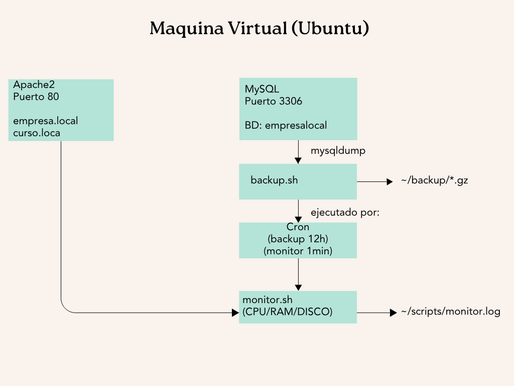

# Arquitectura del Sistema

## Visión general

Todo el proyecto corre sobre un único servidor Linux (Ubuntu Desktop 24.04.4 LTS), montado en una máquina virtual con Oracle VirtualBox sobre un anfitrión Windows. Dentro de esa VM viven cuatro piezas que trabajan juntas: Apache, MySQL, el script de respaldo y el script de monitoreo, todos coordinados por cron.

## Componentes

| Componente | Función | Puerto / ruta |
|---|---|---|
| **Apache2** | Sirve dos sitios web independientes mediante Virtual Hosts | 80 |
| `empresa.local` | Sitio institucional (TechNova Solutions) | `/var/www/empresa.local` |
| `curso.local` | Sitio informativo (Linux Academy) | `/var/www/curso.local` |
| **MySQL** | Base de datos `empresalocal` con tablas `clientes`, `servicios`, `ventas` | 3306 |
| **backup.sh** | Genera un `.sql.gz` de la base de datos con fecha/hora en el nombre | `~/backups/` |
| **monitor.sh** | Revisa CPU, RAM y disco cada minuto; registra alertas con fecha/hora | `~/scripts/monitor.log` |
| **cron** | Dispara `backup.sh` cada 12 horas y `monitor.sh` cada minuto | `crontab -e` / `sudo crontab -e` |

## Flujo de datos

1. Un usuario visita `http://empresa.local` o `http://curso.local`; Apache resuelve la petición al Virtual Host correspondiente y sirve el `index.html` / `style.css` de esa carpeta.
2. Cada 12 horas, cron dispara `backup.sh`: hace `mysqldump` de `empresalocal`, comprime el resultado con `gzip` y lo guarda en `~/backups/` con la fecha y hora en el nombre. Cada corrida queda registrada en `~/backups/backup.log`.
3. Cada minuto, cron dispara `monitor.sh`: mide el uso de CPU, RAM y disco, y si algún valor supera su límite (CPU 80%, RAM 80%, Disco 90%), identifica el proceso más pesado en ese recurso y deja una alerta con fecha/hora en `~/scripts/monitor.log`.
4. Todo el código —scripts, configuración, documentación y contenido de los sitios— vive en un repositorio Git compartido por ambos integrantes.

## Por qué esta distribución

Usar un solo servidor con Virtual Hosts en vez de una VM por servicio mantiene el proyecto simple de administrar: todo el stack (web, base de datos, automatización, monitoreo, control de versiones) se puede revisar y replicar desde un mismo lugar, que es justo lo que buscábamos demostrar con este proyecto.
